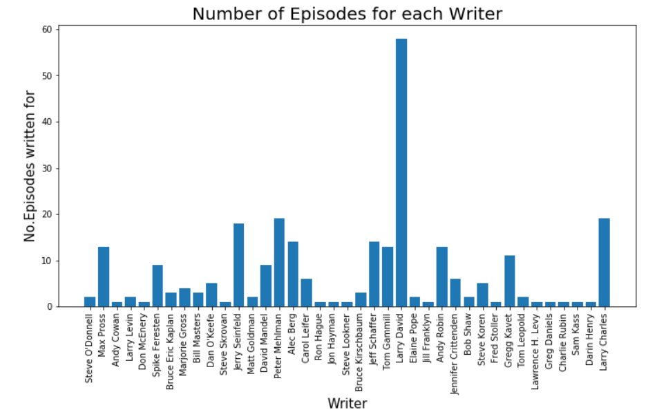

# The Seinfeld!
Arguably the greatest sitcom ever made and certainly my most favourite show ever.

[From Wikipedia](https://en.wikipedia.org/wiki/Seinfeld):
> Seinfeld is an American live-action sitcom created by Larry David and Jerry Seinfeld for NBC. Set predominantly in an apartment building in Manhattan's Upper West Side in New York City, the show features a handful of Jerry Seinfeld's (as a fictionalized version of himself) friends and acquaintances, including best friend George Costanza (Jason Alexander), friend and former girlfriend Elaine Benes (Julia Louis-Dreyfus), and neighbor across the hall Cosmo Kramer (Michael Richards). 

This quick description just scratches the surface of what Seinfeld was and still is; an iconic creation that is frequently ranked by publications such as 'Rolling Stone' and 'Entertainment Weekly' as one of the best comnedies ever made and voted by the 'Writers Guild of America' the No. 2 Best Written TV Series of All Time. Seinfeld has become a cultural touchstone and deeply embedded piece of the cultural zeitgeist spawning words like 'close-talker', catch-phrases like "It's gold, Jerry. Gold!", the truly unique "Elaine Dance" and even a new holiday "Festivus"! Seinfeld had an immeasurable impact on the pop-culture landscape but in this notebook, I plan to use Exploratory Data Analysis and Deep Learning on the complete scripts from the show's entire run  and do just a little bit of measuring.

# The Business Recommendations

## The Brand
'Seinfeld' is global brand, [From Elasticity](https://goelastic.com/three-immutable-branding-lessons-that-seinfeld-taught-us/)
>Seinfeld still runs on 90 percent of TV markets across the country and ranks among American adults’ top five favorite shows. It’s earned more than $3 billion (with a “b”) after its network run ended. And every weeknight, no fewer than one million people tune in to watch reruns.

This year there have been multiple 30th anniversay celebrations and shows such as the ['Seinfeld Experience'](https://deadline.com/2019/06/seinfeld-experience-sets-real-and-spectacular-opening-this-fall-in-new-york-1202638328/) 
>Part retail shop and part immersive show promotion, the ticketed attraction in the city’s Gramercy neighborhood will operate seven days a week. Tickets through February 2020 
>(Deadline.com)

There is huge scope for machine learning based products to utilise the Seinfeld name and brand. This notebook will introduce a learning model based on the identifying the writing of Larry David. This basic idea can be extrapolated and built from to create nuerous writing and languaged based tie ins to the Seinfeld brand. For instance a "write like Larry David" teaching tool fro aspiring sit-com writers or a Seinfeld based adventure game   

## The Fraud Prevention
Seinfeld is a specific example designed for fun and to  be eye-catching but fun and eye-catching can be great introductions techniques to a much more serious subject. More broadly, this type of authorship verification can be generalized to the field of fraud prevention. Training a deep learning model on writing samples from an individual the same way that has been done here could be used as part of a fraud prevention device designed to detect imposters in things like business and email correspondence

### The CEO Fraud
CEO fraud is a perfect candidate for this kind of implementation. 
>CEO Fraud is a scam in which cybercriminals spoof company email accounts and impersonate executives to try and fool an employee in accounting or HR into executing unauthorized wire transfers, or sending out confidential tax information. 
[source](https://www.knowbe4.com/ceo-fraud)

The FBI esitmated the cost of impersonation fraud in the US alone at over $12 Billion in 2018 ([source](https://www.ic3.gov/media/2018/180712.aspx)) and this kind of scam is only becoming increasingly prevalent at an alarming rate:
> ...impersonation attacks increased almost 70 percent (67%) in comparison to the results in last year’s report – with 73 percent of those organizations impacted by impersonation attacks having experienced a direct loss. 
[source](https://www.globenewswire.com/news-release/2019/05/29/1854599/0/en/Mimecast-Global-Research-Finds-Loss-of-Customers-Finances-and-Data-Due-to-Rise-in-Impersonation-Attacks.html)

By training a similar model to the one created in this notebook on business correspondence provided by the company, the writing styles of C-Level executives could be identified and tool created that would flag correspondence by potential impersonators for further scrutiny.

The dataset can be found on kaggle [here](https://www.kaggle.com/thec03u5/seinfeld-chronicles) and consists of 2 tables:
- episode_info.csv
- scripts.csv

<b>episode_info</b> consists of meta-data for each episode, including the episode name and number original air-date

<b>scripts</b> consists of the dialogue spoken by each character and the character that spoke it.

# The Writers

Jerry Seinfeld and Larry David noticable were much more active in writing for the earlier seasons and not at all in the final seasons. Larry David left the show completely after season 7 and only returned for the final episode 'The Finale' Larry David is clearly the most prolific of the writers, writing for 58 episodes nearly a third of the shows 174 episode run. The two next most credited writers Peter Mehlman and Larry Charles wrote on 19 episodes each. Interestingly, Peter Mehlman wrote for every season after season 1 but Larry Charles wrote only from season 2 to Season 5 Jerry Seinfeld himself, the shows co-creator and star, rounds out the top of the writers with 18 credits most of which are written alongside Larry David, Jerry too ceased to write for the show after season 7.

# The Genders

Writers' gender's guessed using the python library gender-guesser https://pypi.org/project/gender-guesser/

17 episodes from the shows run of 174 episodeshave at least one female writer
The first season to have a female writer is Season 3, the seasons with the highest female contributions to writing are Seasons 6 and 8 with 4 of each of the 22 episodes having at least one female writer

# The Main Character

Jerry has the most lines both overall and in every Season, no wonder the show is named after him. He is  followed by George then Elaine then Kramer.

While writing their own sitcom pilot Jerry and George remark how difficult it is for them to write for a woman. The Seinfeld writer's room is heavily male dominated but women did write on almost 10% of all episodes. Are female writers more willing to write for a woman?

Visually it looks very similar to elaine's overall contribution to the show but I'm interested so lets apply some statistical analysis. Using a 2 sided t-test with unequal variance (Welch's t-test) between the number of lines written for elaine in episodes that do and do not have a female writer. 
The null hypothesis for this test that having a female writer on  the episode makes no difference to the number of lines written for elaine: 
H0: fem_mu == no_fem_mu 
H1: fem_mu != no_fem_mu 
We will set a p-value threshold of 0.1 to reject the null hypothesis

Performing the t-test using scikit-learn on the 2 stated distributions gives p-value : 0.77

The p-value is well above our threshold to reject the null hypothesis that having a female writer results in a greater number of lines written for Elaine.

Full notebook for Exploratory Data Analysis and Visualisation: 
https://github.com/ktzioumis/The-Seinfeld/blob/master/The-Seinfeld.ipynb

## The Larry David
Larry David was by far the show's most prolific writer, credited on a third of the total episodes produced. By using a a Keras Deep Learning Model with Natural Language Processing can we tease out Larry David's signature in the dialogue of Seinfeld?

An iterative approach is it taken to model constuction. Each model starts with an Embedding layer and outputs to a single Densely connected node with sigmoid activation. Models are fit for 4 or 5 epochs with batch size of 32 and validation split of 0.1. The lowest validation loss generally occurs after the second epoch and the saved model will reflect this optimization.

The best model has been used for evaluation on the test sample. Bidirectional Gated Recurrent Unit (200 nodes) and three Dense layers (200, 100, 50 nodes) and dropout (0.2) trained for 2 epochs

Model is ~70% accurate on testing data with a loss function of 0.56

Model Peformance Metrics:
Precision: 0.7425886712546321
Recall: 0.6138949671772429
Accuracy: 0.6966136451809566
F1-Score: 0.6721370388116915

Full notebook for Deep Learning Classifier: 
https://github.com/ktzioumis/The-Seinfeld/blob/master/Larry%20David.ipynb

# The Conclusions
The model is successful at determining the whether or not the writer of the dialogue was Larry David. There is, however, room for improvement

# Future Work
1. More data could potentially be obtained from other shows that Larry David has written for such as Saturday Night Live or Curb Your Enthusiasm.
2. Short, simple phrases such as basic greetings could be eliminated from the dataset. Overly simple language is unlikely to have much distinctiveness to it, by using only longer dialogue lines the model is not stumped by a 'hello' that could be written by anyone. This, however, would result in less data to train the model on.
3. Using whole episodes as text corpora for a deeper Larry David understanding. 
4. Making use of the Character speaking as a training feature. Only the text of the dialogue is considered in this model but the stylistic nuances of Larry David are most likely unique to the character being written for

# Business Recommendations

## The Brand
'Seinfeld' is global brand, [From Elasticity](https://goelastic.com/three-immutable-branding-lessons-that-seinfeld-taught-us/)
>Seinfeld still runs on 90 percent of TV markets across the country and ranks among American adults’ top five favorite shows. It’s earned more than $3 billion (with a “b”) after its network run ended. And every weeknight, no fewer than one million people tune in to watch reruns.

This year there have been multiple 30th anniversary celebrations and shows such as the ['Seinfeld Experience'](https://deadline.com/2019/06/seinfeld-experience-sets-real-and-spectacular-opening-this-fall-in-new-york-1202638328/) 
>Part retail shop and part immersive show promotion, the ticketed attraction in the city’s Gramercy neighborhood will operate seven days a week. Tickets through February 2020 
>(Deadline.com)

There is huge scope for machine learning based products to utilize the Seinfeld name and brand. This notebook will introduce a learning model based on the identifying the writing of Larry David. This basic idea can be extrapolated and built from to create numerous writing and language based tie ins to the Seinfeld brand. For instance a "write like Larry David" teaching tool fro aspiring sit-com writers or a Seinfeld based adventure game.    

## The Fraud Prevention
Beyond Seinfeld, this type of application can be generalized to the field of fraud prevention. Training a deep learning model on writing samples from an individual the same way that has been done here could be used as part of a fraud prevention device designed to detect imposters in things like business and email correspondence

### The CEO Fraud
CEO fraud is a perfect candidate for this kind of implementation. 
>CEO Fraud is a scam in which cybercriminals spoof company email accounts and impersonate executives to try and fool an employee in accounting or HR into executing unauthorized wire transfers, or sending out confidential tax information. 
[source](https://www.knowbe4.com/ceo-fraud)

The FBI estimated the cost of impersonation fraud in the US alone at over $12 Billion in 2018 ([source](https://www.ic3.gov/media/2018/180712.aspx)) and this kind of scam is only becoming increasingly prevalent at an alarming rate:
> ...impersonation attacks increased almost 70 percent (67%) in comparison to the results in last year’s report – with 73 percent of those organizations impacted by impersonation attacks having experienced a direct loss. 
[source](https://www.globenewswire.com/news-release/2019/05/29/1854599/0/en/Mimecast-Global-Research-Finds-Loss-of-Customers-Finances-and-Data-Due-to-Rise-in-Impersonation-Attacks.html)

By training a similar model to the one above on business correspondence provided by the company, the writing styles of C-Level executives could be identified and tool created that would flag correspondence by potential impersonators for further scrutiny.

